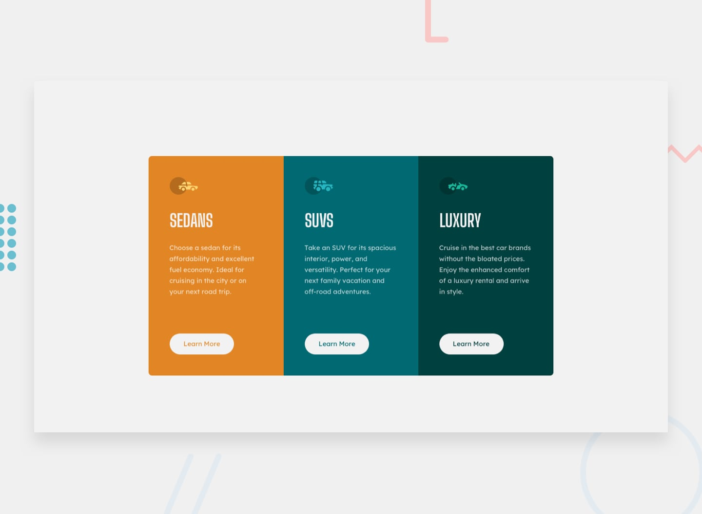

# Frontend Mentor - 3-column preview card component solution

This is a solution to the [3-column preview card component challenge on Frontend Mentor](https://www.frontendmentor.io/challenges/3column-preview-card-component-pH92eAR2-). Frontend Mentor challenges help you improve your coding skills by building realistic projects.

## Table of contents

- [Overview](#overview)
  - [The challenge](#the-challenge)
  - [Screenshot](#screenshot)
  - [Links](#links)
- [My process](#my-process)
  - [Built with](#built-with)
  - [What I Learned & Mistakes I Fixed](#what-i-learned&mistakes-i-fixed)
  - [Continued development](#continued-development)
  - [Useful resources](#useful-resources)
  - [AI Collaboration](#ai-collaboration)
- [Author](#author)

## Overview

### The challenge

Users should be able to:

- View the optimal layout depending on their device's screen size
- See hover states for interactive elements

### Screenshot



### Links

- Solution URL: [solution URL](https://github.com/debumandal/3-column-preview-card-component)
- Live Site URL: [live site URL](https://debumandal.github.io/3-column-preview-card-component/)

## My process

### Built with

- Semantic HTML5 markup (`<main>`, `<section>`, `<h2>`)
- CSS Custom Properties (Variables)
- CSS Grid (Desktop 3-column & mobile stacked layout)
- CSS Flexbox (Page centering & alignment)
- Responsive Design via Media Queries

---

### What I Learned & Mistakes I Fixed

#### 1. Managing CSS Box Model on Hover States (Fixing Button "Jump")

- **The Mistake:** I initially set `border: 0;` on the default button state and only added `border: 0.125rem solid ...` on `:hover`. This dynamically changed the button's physical dimensions when hovered, causing an annoying jumping/shifting layout glitch.
- **The Fix:** I learned to reserve the border space from the start using `border: 0.125rem solid transparent;`. This keeps the box dimensions completely identical before and after hover.

```css
/* Default state - border space is already reserved */
.card-sedans .btn {
  background-color: var(--general-bg-hd-btn-color);
  color: var(--column1-gold-color);
  border-radius: 1.4rem;
  border: 0.125rem solid transparent;
  padding: 0.8rem;
  width: 60%;
  cursor: pointer;
}

/* Hover state - only the color changes */
.card-sedans .btn:hover {
  color: var(--general-bg-hd-btn-color);
  border: 0.125rem solid var(--general-bg-hd-btn-color);
  background-color: var(--column1-gold-color);
}
```

#### 2. Avoiding CSS Cascade / Selector Overwrites

- **The Mistake:** I declared `.btn` three times at the global level with different text colors. Because later CSS rules overwrite earlier ones, every button inherited the color of the last written rule.
- **The Fix:** I properly scoped button styles to their parent container classes (`.card-sedans .btn`, `.card-suvs .btn`, `.card-luxury .btn`), allowing each card to maintain its own unique theme colors.

#### 3. Semantic Heading Hierarchy & Decorative Image Accessibility

- **The Mistake:** I originally used multiple `<h1>` tags for the individual card titles and redundant `alt` text descriptions on decorative icons.
- **The Fix:** I changed the card headings to `<h2>` to maintain a proper semantic document outline and used `alt=""` for the purely decorative car SVG icons so screen readers skip redundant announcements.

#### 4. CSS Syntax Accuracy (`border` vs. `border-color`)

- **The Mistake:** I mistakenly wrote `border-color: 0.125rem solid var(--color);`. Since `border-color` only takes a color value (not width and style), the browser ignored the rule entirely.
- **The Fix:** I corrected it to use the shorthand `border: 0.125rem solid var(--general-bg-hd-btn-color);`.

---

### Continued development

In upcoming challenges, I plan to focus on:

- **Strict Mobile-First Workflow:** Writing baseline styles for mobile screen sizes first, then layering on `min-width` media queries for tablet and desktop viewports to reduce redundant CSS code.

- **Micro-Interactions & Transitions:** Adding smooth `transition: all 0.3s ease;` effects to buttons and interactive links so hover color shifts feel seamless.

- **CSS Grid Mastery:** Experimenting with dynamic functions like `grid-template-columns: repeat(auto-fit, minmax(250px, 1fr))` to create fluid, self-responsive grid cards that need fewer manual media query breakpoints.

- **Accessibility & Keyboard Navigation:** Implementing explicit `:focus-visible` outline styles so keyboard users have a distinct visual indicator when navigating between interactive buttons.

### Useful resources

- [MDN Web Docs - The Box Model](https://developer.mozilla.org/en-US/docs/Learn/CSS/Building_blocks/The_box_model) - Great explanation of content, padding, border, and margin calculations.
- [CSS-Tricks - A Complete Guide to CSS Grid](https://css-tricks.com/snippets/css/complete-guide-grid/) - Invaluable reference for setting up multi-column layouts and responsive grid tracks.

### AI Collaboration

For this challenge, I leveraged AI as a pair programmer and mentor throughout the development and debugging lifecycle:

- **Concept Clarification over Code Generation:** Rather than copying generated snippets, I used AI to diagnose underlying browser mechanics (e.g., how the CSS Box Model triggers layout reflow on dynamic border insertion).

- **Code Review & Accessibility Audits:** Iteratively submitted markup to check heading level compliance (`h1` vs `h2`), image accessibility (`alt=""` for decorative assets), and CSS syntax validation.

- **Troubleshooting Logic:** Used conversational debugging prompts to isolate specificity conflicts and redundant media query declarations.

## Author

- Frontend Mentor - [@Debumandal](https://www.frontendmentor.io/profile/debumandal)
- GitHub - [@Debumandal](https://github.com/debumandal)
